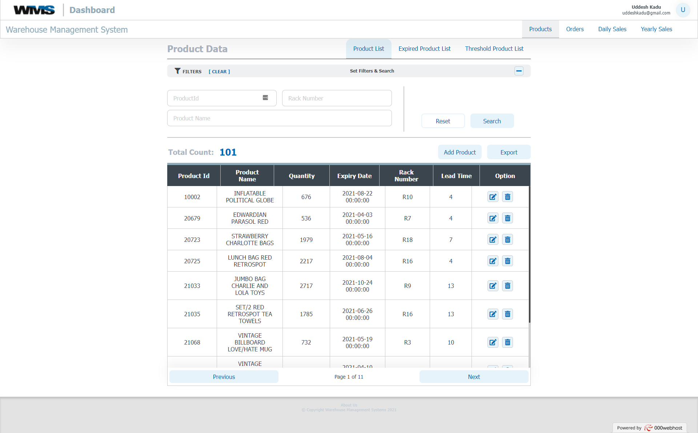
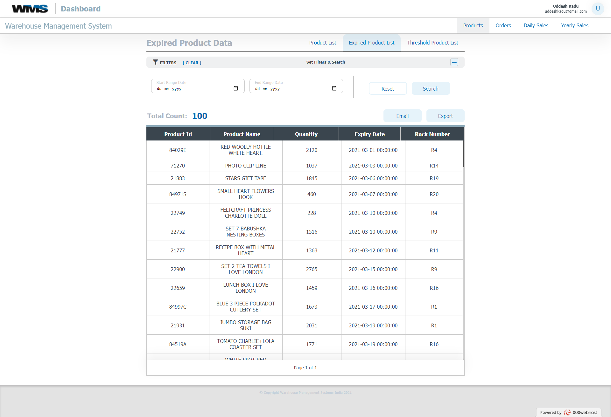
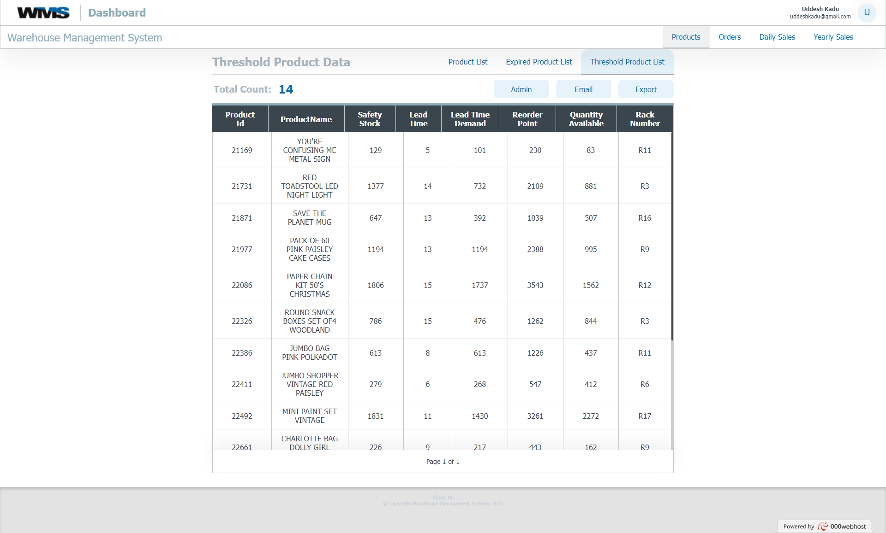
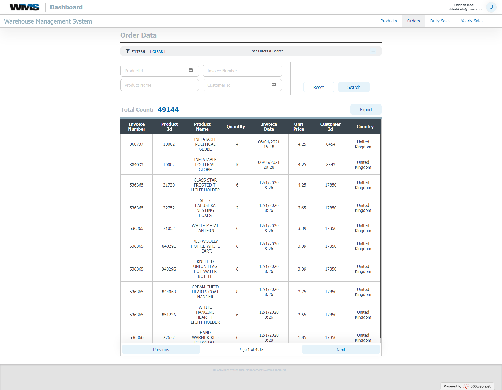
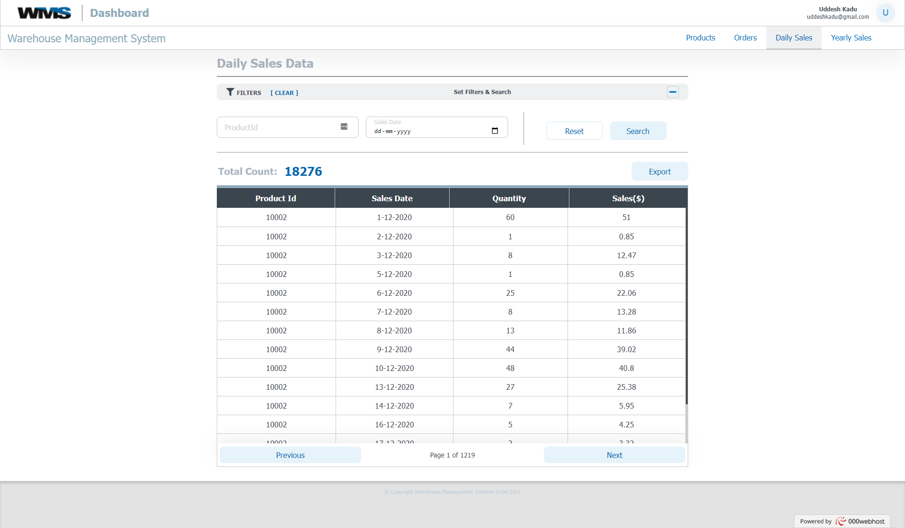
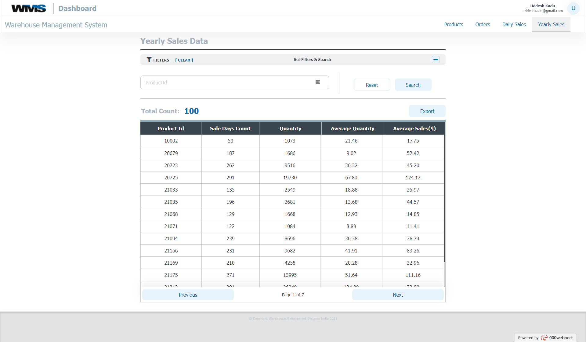
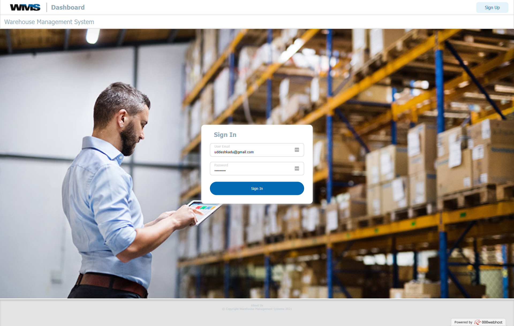
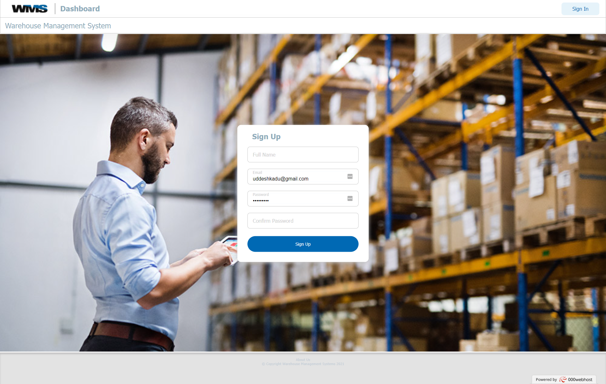

# Warehouse-Management-System
Front-end: HTML, JavaScript and Sass 
Back-end: PHP 
Database: MySQL

1.Web-based application to store, maintain, retrieve and aggregate inventory data
2.It tracks expired stocks, location of stock, availability of products and updating of stock in inventory
3.Automated generation and mailing of reports.

Pages  
1. Displays all product data, also display the location where product have been stored.

2. Displays list of expired products. This can also be filtered based on date

3. Displays list of product which may go out of stock if not currently ordered. This list can mailed to self

4. Display previous orders

5. Display sales by day for each product

  
6. Display sales by year for each product

 
 7. Login Page

8. Signup Page

Hosted Url: https://wms2k21.000webhostapp.com/site/page/home.php
